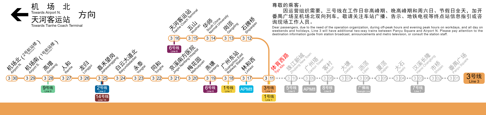
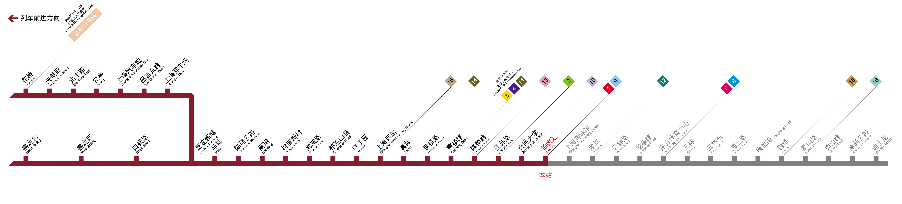
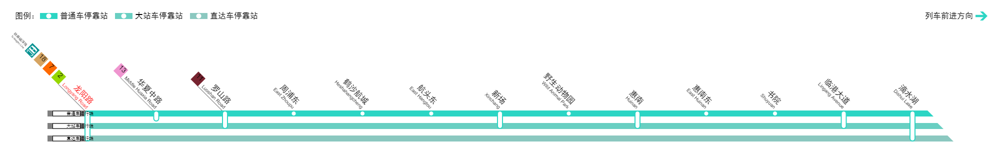
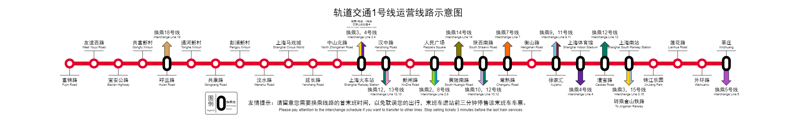

# Rail Map Generator (RMG)

A tool for generating railway maps and information panels in the styles of following public transportation systems:

- Guangzhou Metro (Guangzhou)
- MTR (Hong Kong)
- Shanghai Metro (Shanghai)

Make your own rail map on [GitHub Pages](https://railmapgen.github.io/rmg/) | [GitLab Pages](https://railmapgen.gitlab.io/rmg/) or get the latest offline desktop application at the [Release Page](https://github.com/railmapgen/rmg/releases).

---

## Guangzhou Metro

## MTR

## Shanghai Metro

---

# Contributors

## Core contributors

<table>
  <tr>
    <td align="center" style="border-width:0px">
      <a herf="https://github.com/wongchito">
         
        <b>Chito Wong</b> 
      </a>
      Project initiator 
      MTR and Guangzhou Metro Author 
    </td>
    <td align="center" style="border-width:0px">
      <a herf="https://github.com/thekingofcity">
         
        <b>thekingofcity</b> 
      </a>
      Shanghai Metro Author 
      Electron Maintainer 
    </td>
  </tr>
</table>

## Colors palette and line templates contributors

> This list may not reflect the latest data. See [contributors at rmg-palette](https://github.com/railmapgen/rmg-palette/graphs/contributors) and [contributors at rmg-templates](https://github.com/railmapgen/rmg-templates/graphs/contributors). We'll make this list updated at any time soon, stay tuned.

<table>
  <tr>
    <td align="center" style="border-width:0px">
      <a herf="https://github.com/52PD">
         
        <b>52PD</b> 
      </a>
    </td>
    <td align="center" style="border-width:0px">
      <a herf="https://github.com/jealousyge">
         
        <b>jealousyge</b> 
      </a>
    </td>
    <td align="center" style="border-width:0px">
      <a herf="https://github.com/AnDanJuneUnderline">
         
        <b>AnDanJuneUnderline</b> 
      </a>
    </td>
    <td align="center" style="border-width:0px">
      <a herf="https://github.com/Jay20081229">
         
        <b>Jay20081229</b> 
      </a>
    </td>
    <td align="center" style="border-width:0px">
      <a herf="https://github.com/clearng-kly">
         
        <b>clearng-kly</b> 
      </a>
    </td>
    <td align="center" style="border-width:0px">
      <a herf="https://github.com/Dingdong2334">
         
        <b>Dingdong2334</b> 
      </a>
    </td>
    <td align="center" style="border-width:0px">
      <a herf="https://github.com/linchen1965">
         
        <b>linchen1965</b> 
      </a>
    </td>
    <td align="center" style="border-width:0px">
      <a herf="https://github.com/C1P918R">
         
        <b>C1P918R</b> 
      </a>
    </td>
    <td align="center" style="border-width:0px">
      <a herf="https://github.com/GrassRabbit1410">
         
        <b>GrassRabbit1410</b> 
      </a>
    </td>
    <td align="center" style="border-width:0px">
      <a herf="https://github.com/xiany114514">
         
        <b>xiany114514</b> 
      </a>
    </td>
    <td align="center" style="border-width:0px">
      <a herf="https://github.com/Andy1782010">
         
        <b>Andy1782010</b> 
      </a>
    </td>
    <td align="center" style="border-width:0px">
      <a herf="https://github.com/Thomastzc">
         
        <b>Thomastzc</b> 
      </a>
    </td>
    <td align="center" style="border-width:0px">
      <a herf="https://github.com/Tianxiu11111">
         
        <b>Tianxiu11111</b> 
      </a>
    </td>
  </tr>
</table>

<!-- ## User guide

### Getting started

-   use current canvas or click 'new canvas'

### Adding stations

### Adding interchanges

### Adding branches

### Saving jobs

### Exporting -->
