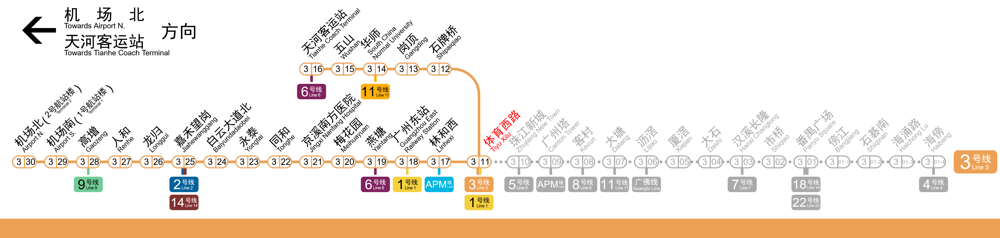

# Rail Map Generator (RMG)

A powerful tool for generating railway maps and information panels in the styles of major public transportation systems:

- **Guangzhou Metro** (Guangzhou)
- **MTR** (Hong Kong)
- **Shanghai Metro** (Shanghai)

## 🚀 Get Started

Create your own rail map at **[railmapgen.org](https://railmapgen.org/?app=rmg)** or use our mirrors:

- [GitHub Pages](https://railmapgen.github.io/?app=rmg)
- [GitLab Pages](https://railmapgen.gitlab.io/?app=rmg)

📱 **Offline applications** are available on our [Release Page](https://github.com/railmapgen/railmapgen.github.io/releases).

---

## Guangzhou Metro

## MTR

## Shanghai Metro

---

## Contributors

Contributors are available [here](https://railmapgen.org/?app=contributors).
