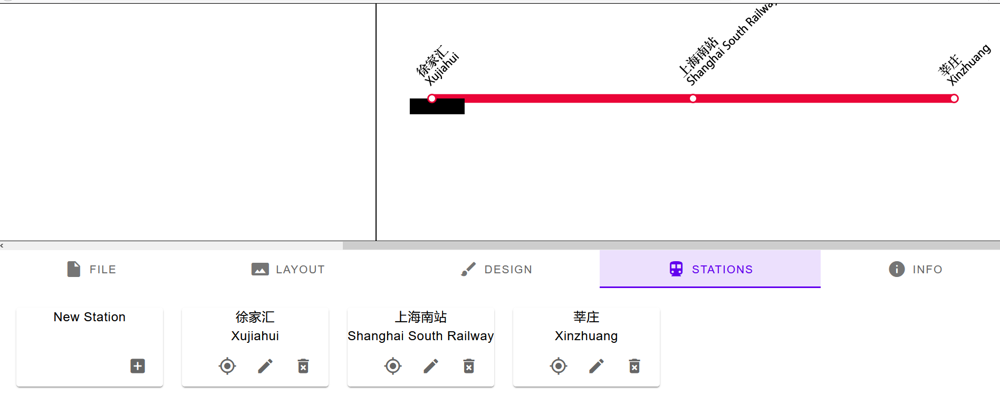

# Some notes on building from source and adding new styles

[toc]

## Building from source

```bash
> npm config set registry https://registry.npm.taobao.org
> npm install -g typescript
+ typescript@3.7.5
> npm install @types/jquery
+ @types/jquery@3.3.31
> tsc
```

You should see some errors with ```TS2339: Property 'xxx' does not exist on type 'HTMLElement'```, but that's ok.

``` bash
> python -m http.server 80
```

## Adding new styles

Following are only *DRAFTS* and may be altered at any time.

1. Add ```case``` for your style at ```index.html:33```
2. Create new ```.ts``` file in ```/src/Line/``` and the new class must be inherit from ```RMGLine```
3. Create new ```.ts``` file in ```/src/Station``` if you need a new style of station icon
4. Import your new class in ```/src/Line/init.ts``` header and add ```case``` at line 18
5. Test your code by querying ```?style=[yournewstyle]``` or add selection at ```index.html:685```

### To add new text

Add new language entry in ```/lang/*.json``` if you add selection at ```index.html:685```

### To change station and line style

1. Add ```_nameShift```, ```_tickRotation```, ```iconHTML```, ```nameHTML``` at ```/src/Station/Station**.ts```
2. **Add specific svg path at ```index.html:svg#railmap.defs```**. This is where the ```xlink:herf``` links from.

### To fix the mysterious black rect


Rewite the ```updateStnNameBg``` in ```RMGLine**``` at ```/src/Line/Line**.ts``` and add ```$('#current_bg').hide();```.
